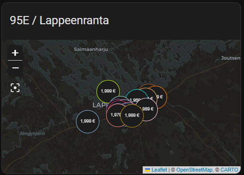

# Tankille for Home Assistant

## What is it?

An unofficial custom component that integrates with tankille.fi to retrieve fuel prices. Fuel prices are retrieved from gas stations
defined by latitude and longitude, and the maximum allowed distance from these coordinates. A separate device
is created from each of the gas stations, different fuel types/prices are shown as sensors under that device.
Typical use case would be to add these sensors to a lovelace map card. 

## Installation

### Manual

1. Download source code from latest release tag
2. Copy custom_components/tankille folder to your Home Assistant installation's config/custom_components folder.
3. Restart Home Assistant
4. Configure the integration by adding a new integration in settings/integrations page of Home Assistant
5. Enter your account credentials and configre other settings as you wish

### Integration settings

| Name      | Type    | Requirement  | Description                                                                     | Default   |
|-----------|---------| ------------ |---------------------------------------------------------------------------------|-----------|
| label     | string  | **Required** | Label for the configuration (shown in Home Assistant's integration view)        |           |
| username  | string  | **Required** | Username of your tankille.fi account (your email)                               |           |
| password  | string  | **Required** | Password of your tankille.fi account                                            |           |
| language  | string  | **Required** | Used language (fi or en)                                                        | `fi`      |
| latitude  | decimal | **Required** | Latitude for the center point of the area where fuel prices are retrieved from  | `61.0559` |
| longitude | decimal | **Required** | Longitude for the center point of the area where fuel prices are retrieved from | `28.1830` |
| distance  | int     | **Required** | Maximum distance in meters from the center point                                | `10000`   |

### Example configuration for a map card

card-mod is recommended, as by default the font size is too big to fit in the map marker. 



```
type: map
entities:
  - entity: sensor.neste_lappeenranta_cm_95e10
    label_mode: state
  - entity: sensor.abc_prisma_lappeenranta_95e10
    label_mode: state
  - entity: sensor.seo_lappeenranta_kaukas_95e10
    label_mode: state
  - entity: sensor.st1_lappeenranta_hakali_95e10
    label_mode: state
  - entity: sensor.shell_lappeenranta_lauritsala_95e10
    label_mode: state
title: 95E / Lappeenranta
default_zoom: 12
aspect_ratio: '16:9'
card_mod:
  style:
    ha-map$: |
      .leaflet-marker-icon {
        font-size: 6px;
      }
```